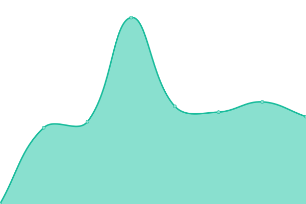

# [📈 Live Status](https://loveibora.github.io/test): <!--live status--> **🟩 All systems operational**

This repository contains the open-source uptime monitor and status page for [loveibora](https://loveibora.github.io/test), powered by [Upptime](https://github.com/upptime/upptime).

With [Upptime](https://upptime.js.org), you can get your own unlimited and free uptime monitor and status page, powered entirely by a GitHub repository. We use [Issues](https://github.com/loveibora/test/issues) as incident reports, [Actions](https://github.com/loveibora/test/actions) as uptime monitors, and [Pages](https://loveibora.github.io/test) for the status page.

<!--start: status pages-->
<!-- This summary is generated by Upptime (https://github.com/upptime/upptime) -->
<!-- Do not edit this manually, your changes will be overwritten -->
<!-- prettier-ignore -->
| URL | Status | History | Response Time | Uptime |
| --- | ------ | ------- | ------------- | ------ |
|  [naver](https://www.naver.com) | 🟩 Up | [naver.yml](https://github.com/loveibora/test/commits/HEAD/history/naver.yml) | 

 1006ms
     
 | 

<a href="https://loveibora.github.io/test/history/naver">100.00%</a>
    

|  [smartsearch](https://smartsearch.kosha.or.kr) | 🟩 Up | [smartsearch.yml](https://github.com/loveibora/test/commits/HEAD/history/smartsearch.yml) | 

 1584ms
     
 | 

<a href="https://loveibora.github.io/test/history/smartsearch">100.00%</a>
    

<!--end: status pages-->

[**Visit our status website →**](https://loveibora.github.io/test)

## 📄 License

- Powered by: [Upptime](https://github.com/upptime/upptime)
- Code: [MIT](./LICENSE) © [loveibora](https://loveibora.github.io/test)
- Data in the `./history` directory: [Open Database License](https://opendatacommons.org/licenses/odbl/1-0/)
